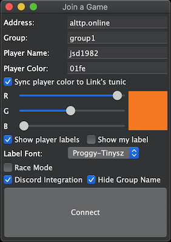
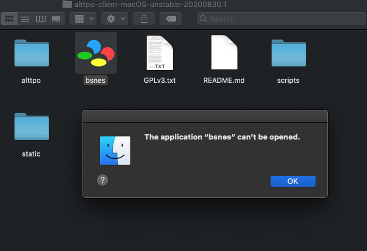
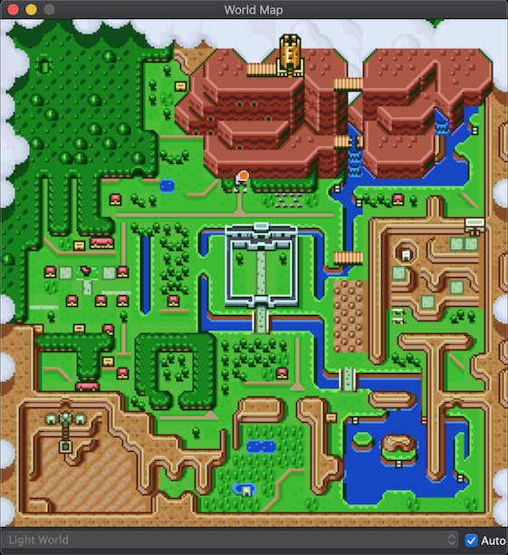

# A Link to the Past Online - ALttPO
ALttPO script integration for [bsnes-as](//github.com/alttpo/bsnes-as).

See a demo video: https://www.youtube.com/watch?v=_MTfXCUXawg

Join us on discord! https://discord.gg/AVQ2yKd - this is where the community is and you get access to latest updates and be able to suggest and vote on new features.

Donate, if you like, to support ALttPO development!

[](https://www.paypal.com/cgi-bin/webscr?cmd=_donations&business=WC53V2L3ZX4DC&item_name=ALttPO+Development&currency_code=USD&source=url)

# Play with a friend over the Internet

**PREREQUISITES**: You need your own copy of the ALTTP game ROM image. DO NOT ASK ME FOR ONE; I will ignore you so hard. It is illegal to redistribute ROM images.

Download latest _stable_ client here (preferred for new/casual players):

[](https://dev.azure.com/ALttPO/alttpo/_build/latest?definitionId=4&branchName=master)

OR download the latest _unstable_ client here (for testing experimental features and work-in-progress):

[](https://dev.azure.com/ALttPO/alttpo/_build/latest?definitionId=4&branchName=unstable)

Click the "8 published" link under the "Related" section to go to the Artifacts page:


Click the highlighted download arrow on the far right for the client you want to download depending on your system.

You do not need to download a server build unless you plan to run your own server.

Everything you need is contained in the client build. There should be nothing extra to download.

1. **IMPORTANT**: If you cloned the github repository then stop, go back to step 1, and download the pre-built image for your system instead.
1. Launch `bsnes.exe` (Windows) or `bsnes.app` (macOS), depending on your system.
1. In bsnes, System > Load Game... and find your ALTTP ROM.
1. In bsnes, Script > Load Script Folder... and select `alttpo` folder from the current directory.
1. Find the "Join a Game" window that should have popped up after loading the script. It may have popped under the main BSNES window.
1. Find a friend to play with; make sure they follow all these steps up to this point.
1. Leave the "Address" field alone unless you intend on running your own ALTTP multiplayer server instance. [See below](#running-your-own-server) if you wish to do so.
1. Agree with your friend on a unique group name and enter it into the "Group" field. This group name can be anything but make sure it's unique enough for others not to guess otherwise they might be able to join your game. The group name field is limited to 20 characters and is not case sensitive.
1. Click "Connect" button.
1. Play through the game together and report bugs and/or feature requests back to me at https://github.com/alttpo/alttpo/issues .

Thanks for testing!

## Join a Game window


| Field               | Purpose                                                                                                                                                                                                                                                                |
|---------------------|------------------------------------------------------------------------------------------------------------------------------------------------------------------------------------------------------------------------------------------------------------------------|
| Address             | Server address (DNS or IP address) to connect to; the default alttp.online server is a small Linode instance hosted in Newark, NJ, US.                                                                                                                                 |
| Group               | Name of the group to join on the server, aka lobby. Max 20 characters, not case sensitive, whitespace trimmed at both ends.                                                                                                                                            |
| Player Name         | Your name for other players to see in their game screens (if Show player labels is enabled)                                                                                                                                                                            |
| Player Color        | Either enter a 16-bit hex value to represent the BGR color which is SNES compatible, or use the R,G,B sliders below to pick the color.                                                                                                                                 |
| Sync player color   | Adjusts Link's palette for his tunic to use the Player Color and a 75% brightness color for shading.                                                                                                                                                                   |
| R,G,B sliders       | Adjusts the Red, Green, and Blue components of the Player Color                                                                                                                                                                                                        |
| Show player labels  | Renders player name labels in the game screen underneath remote player avatars                                                                                                                                                                                         |
| Show my label       | Renders your own player name label under your own avatar                                                                                                                                                                                                               |
| Label Font          | The pixel font used to render player name labels with                                                                                                                                                                                                                  |
| Race Mode           | Players who check this box will not send or receive game state updates to/from any other player but will still be visible to other players on the map and the in-game screen. Players who have this box unchecked will share items, progress, crystals, pendants, etc. |
| Discord integration | Integrates with your local Discord client to provide activity updates.                                                                                                                                                                                                 |
| Hide Group Name     | Hide your group name in the Discord activity updates.                                                                                                                                                                                                                  |

Press the `Connect` button to go online and join your group. This window will stay open while connected so that you may adjust your player name and player color at will. The updates will be synced in real time to other players.

## Troubleshooting

1. Q: Help! I cannot see other players! I'm connected and am sharing inventory but cannot see any other sprites.
    1. Open up bsnes Settings > Enhancements... > PPU (video) > Enable "Fast mode".
    1. The fast PPU renderer must be used to see other players and notification messages rendered on your game screen.
    1. The reason why is because there are actually two independent PPU renderers built into bsnes and I've only extended
    the "fast" PPU renderer and not the "slow" PPU renderer.
1. Q: Help! We can see each other but none of our items or progress are syncing!
    1. Make sure the "Disable sync" checkbox is not enabled in the "Join a Game" window for ALL players connected to the group.
    1. Make sure all players in the group use the exact same Group name.
    1. Make sure all players in the group have clicked "Connect" and that the button is disabled and the "Disconnect" button is enabled.
    1. Make sure you're all using the same server Address. Use "alttp.online" as the default unless you're hosting your own server.
    1. Be sure you have UDP port 4590 open for bidirectional communication to the public internet.

### MacOS Catalina

#### Help! I cannot open bsnes-as on MacOS Catalina (10.15)!



If you see this window, delete your extracted folder and instead extract the downloaded archive using https://www.keka.io/en/ file archiver, or any other archive software besides the built-in "Archive Utility.app". In other words, DO NOT use the built-in "Archive Utility.app" to extract the download or MacOS Catalina will refuse to open the app.

### Other issues

For any other issues, please feel free to use the Github Issues feature and make a report, or go to our discord and use the #bug-reports channel.

## Map window


In this window you will see small colored circular map markers that represent the approximate location of other players in your group. Your player color determines the color of the map marker.

Uncheck the `Auto` checkbox to allow manual switching between Light World and Dark World map views. Keep it checked to synchronize the map window to your current Light/Dark World position.

# Linux Support

If running Ubuntu 18.04, install these required packages:

```
$ sudo apt install libgtksourceview2.0-0 libao4
```

If running Arch Linux, install these required packages:

```
$ sudo pacman -S gtksourceview2 libao
```

Also be sure to make the `bsnes` file executable:
```
$ chmod +x bsnes
```

The executable bit unfortunately gets lost in translation when creating the build artifact archive.

# Running Your Own Server

If you wish to run your own ALttPO server, you will need:

1. a server, publicly accessible from the Internet
1. a static IP address assigned to your server or knowledge of your current IP address assigned by your ISP
1. optionally a DNS name assigned to your static IP address
1. access to UDP port 4590 through firewall
1. server operating system supported by Golang 1.12+ (linux is preferable)
1. golang development environment installed on the server

Log in to your server (I'll assume it's Linux or at least has a bash-like shell) and follow these steps:

1. `mkdir -p /srv/go`
1. `export GOPATH=/srv/go`
1. `go install github.com/alttpo/alttpo/alttp-server@latest`

Create this systemd service unit file at `/etc/systemd/system/alttp-server.service`:

```
[Unit]
Description=ALTTP UDP multiplayer group server on port 4590

[Service]
WorkingDirectory=/tmp
ExecStart=/srv/go/bin/alttp-server
User=nobody
Group=nogroup
Restart=always

[Install]
WantedBy=multi-user.target
```
 
To start the service immediately, run:
```
$ sudo systemctl start alttp-server
```

To enable the service to have it always start on boot, run:
```
$ sudo systemctl enable alttp-server
```

The main takeaways here are that you just need a nice place to store the compiled binary `alttp-server` and you should be able to run it as `nobody` UID with `nogroup` GID to limit its access to the rest of your system. Definitely DO NOT run it as a privileged user of any kind. The less privileges it has, the better. All it needs to do is bind to UDP port 4590 and send UDP messages and nothing else.
