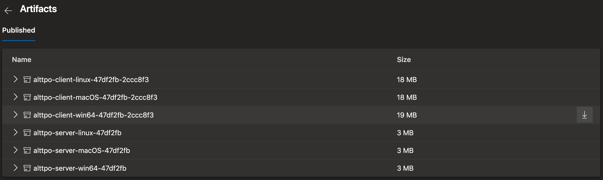
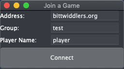

# A Link to the Past Online - ALttPO
ALttPO script integration for [bsnes-angelscript](//github.com/JamesDunne/bsnes-angelscript).

See a demo video: https://www.youtube.com/watch?v=_MTfXCUXawg

Join us on discord! https://discord.gg/AVQ2yKd - this is where the community is and you get access to latest updates and be able to suggest and vote on new features.

# Play with a friend over the Internet

**PREREQUISITES**: You need your own copy of the ALTTP game ROM image. DO NOT ASK ME FOR ONE; I will ignore you so hard. It is illegal to redistribute ROM images.

Download latest _stable_ client here (preferred for new/casual players):

[](https://dev.azure.com/ALttPO/alttpo/_build/latest?definitionId=2&branchName=master)

OR download the latest _unstable_ client here (for testing experimental features and work-in-progress):

[](https://dev.azure.com/ALttPO/alttpo/_build/latest?definitionId=2&branchName=unstable)

Click the "8 published" link under the "Related" section to go to the Artifacts page:



Click the highlighted download arrow on the far right for the client you want to download depending on your system.

You do not need to download a server build unless you plan to run your own server.

Everything you need is contained in the client build. There should be nothing extra to download.

1. Download the latest pre-built stable client for your system [here](https://dev.azure.com/ALttPO/alttpo/_build?definitionId=2&_a=summary&view=runs&statusFilter=succeeded&repositoryFilter=2&branchFilter=7).
1. **IMPORTANT**: If you cloned the github repository then stop, go back to step 1, and download the pre-built image for your system instead.
1. Launch `bsnes.exe` (Windows) or `bsnes.app` (macOS), depending on your system.
1. In bsnes, System > Load Game... and find your ALTTP ROM.
1. In bsnes, Script > Load Script Folder... and select `alttpo` folder from the current directory.
1. Find the "Join a Game" window that should have popped up after loading the script. It may have popped under the main BSNES window. 
1. Find a friend to play with; make sure they follow all these steps up to this point.
1. Leave the "Address" field alone unless you intend on running your own ALTTP multiplayer server instance. [See below](#running-your-own-server) if you wish to do so.
1. Agree with your friend on a unique group name and enter it into the "Group" field. This group name can be anything but make sure it's unique enough for others not to guess otherwise they might be able to join your game. The group name field is limited to 20 characters and is not case sensitive.
1. Click "Connect" button.
1. Play through the game together and report bugs and/or feature requests back to me at https://github.com/JamesDunne/alttp-multiplayer/issues .

Thanks for testing!

# Linux Support

On Ubuntu 18.04, install these required packages:
```
$ sudo apt install libgtksourceview2.0-0 libao4
```

Also be sure to make the `bsnes` file executable:
```
$ chmod +x bsnes
```

The executable bit unfortunately gets lost in translation when creating the build artifact archive.

# Running Your Own Server

If you wish to run your own ALttPO server, you will need:

1. a server, publicly accessible from the Internet
1. a static IP address assigned to your server or knowledge of your current IP address assigned by your ISP
1. optionally a DNS name assigned to your static IP address
1. access to UDP port 4590 through firewall
1. server operating system supported by Golang 1.12+ (linux is preferable)
1. golang development environment installed on the server

Log in to your server (I'll assume it's Linux or at least has a bash-like shell) and follow these steps:

TODO: elaborate on this better!!!
1. `go install github.com/JamesDunne/alttp-multiplayer/alttp-server`
1. `$HOME/go/bin/alttp-server`

Consult your system documentation on how to create a service wrapper around the `alttp-server` process.

My server is running an older variant of Ubuntu 14.04 LTS and as such still uses the old `upstart` service manager. Here is my `/etc/init/alttp-server.conf` upstart conf file for reference:

```
# configuration for upstart

description     "ALTTP UDP multiplayer group server on port 4590"
author          "James Dunne <james.jdunne@gmail.com>"

start on runlevel [2345]
stop on starting rc RUNLEVEL=[016]

respawn
respawn limit 2 5

setuid nobody
setgid nogroup

console log
exec /srv/bittwiddlers.org/go/bin/alttp-server
```

The main takeaways here are that you just need a nice place to store the compiled binary `alttp-server` and you should be able to run it as `nobody` UID with `nogroup` GID to limit its access to the rest of your system. Definitely DO NOT run it as a privileged user of any kind. The less privileges it has, the better. All it needs to do is bind to UDP port 4590 and send UDP messages and nothing else.
